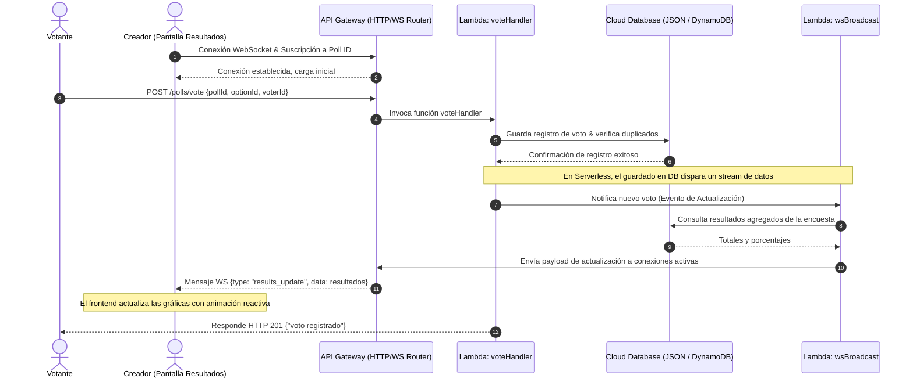

# Documento de Arquitectura y Diseño Técnico

Este documento detalla el análisis del dominio, los requerimientos del sistema y la arquitectura serverless del sistema de **Encuestas Online en Tiempo Real (Votify)**.

---

## 1. Análisis del Dominio y Modelo de Datos

El sistema de encuestas se modela a partir de tres entidades fundamentales. En una base de datos serverless NoSQL (como AWS DynamoDB o Google Cloud Firestore), estas entidades se organizan de forma desnormalizada para optimizar los accesos de lectura/escritura escalables.

### Entidades Principales

1.  **User (Usuario / Creador)**: Representa a los usuarios autenticados que pueden crear y administrar sus encuestas.
    *   `id` (String - PK): Identificador único de usuario.
    *   `username` (String): Nombre de usuario único.
    *   `passwordHash` (String): Hash seguro de la contraseña.
    *   `createdAt` (String): Fecha de creación.

2.  **Poll (Encuesta)**: Representa la estructura de la encuesta configurada por el usuario.
    *   `id` (String - PK): Identificador único de la encuesta.
    *   `creatorId` (String - FK): Relación con el creador de la encuesta.
    *   `title` (String): Pregunta principal.
    *   `description` (String): Notas adicionales opcionales.
    *   `options` (Array of Objects): Lista de opciones válidas:
        *   `id` (String): Código único de opción (ej: `opt_x1y2z3`).
        *   `text` (String): Texto de la opción de respuesta.
    *   `settings` (Object): Parámetros de la encuesta:
        *   `multipleChoice` (Boolean): Indica si se puede votar por varias opciones.
        *   `anonymous` (Boolean): Indica si es abierta sin loguearse.
    *   `createdAt` (String): Fecha de creación.

3.  **Vote (Voto)**: Registro individual de un voto para auditar duplicados.
    *   `id` (String - PK): Identificador del voto.
    *   `pollId` (String - FK): Identificador de la encuesta asociada.
    *   `optionId` (String - FK): Opción elegida.
    *   `voterId` (String): Clave para control de duplicados (IP, cookie del navegador o Token JWT).
    *   `votedAt` (String): Timestamp de la votación.

---

## 2. Diagramas de Diseño

### Diagrama 1: Arquitectura General Serverless (Nube Real vs. Emulador Local)

El sistema real está diseñado para ejecutarse sobre servicios administrados de AWS, minimizando la administración de servidores:

```mermaid
graph TD
    Client[Cliente / Navegador Web] <-->|HTTP / WebSockets| APIGateway[AWS API Gateway]
    
    subgraph AWS Cloud (Servicios Administrados)
        APIGateway -->|Enruta Peticiones REST| LambdaAuth[AWS Lambda: Auth Function]
        APIGateway -->|Enruta Peticiones REST| LambdaCreate[AWS Lambda: Create Poll Function]
        APIGateway -->|Enruta Peticiones REST| LambdaVote[AWS Lambda: Vote Function]
        
        LambdaAuth -->|Persiste Usuarios| DB[(AWS DynamoDB)]
        LambdaCreate -->|Persiste Encuestas| DB
        LambdaVote -->|Registra Votos| DB
        
        DB -->|DynamoDB Streams | Stream[Stream de Datos de Votos]
        Stream -->|Dispara Evento| LambdaWS[AWS Lambda: WS Broadcast Function]
        
        APIGateway <.->|Gestiona Conexiones WS| LambdaWS
    end

    style APIGateway fill:#f96,stroke:#333,stroke-width:2px
    style LambdaAuth fill:#85c1e9,stroke:#333,stroke-width:1px
    style LambdaCreate fill:#85c1e9,stroke:#333,stroke-width:1px
    style LambdaVote fill:#85c1e9,stroke:#333,stroke-width:1px
    style LambdaWS fill:#85c1e9,stroke:#333,stroke-width:1px
    style DB fill:#82e0aa,stroke:#333,stroke-width:2px
```

*Nota: Para facilitar la ejecución local y la calificación, el proyecto implementa un emulador en Node.js donde Express actúa como API Gateway, los endpoints actúan como Lambdas independientes y un despachador de eventos con WebSockets simula el disparador del flujo de datos (Streams) de la base de datos.*

---

### Diagrama 2: Diagrama de Secuencia - Registro de Voto y Actualización en Tiempo Real

Muestra el flujo de información reactiva desde que un votante hace clic en una opción hasta que todos los clientes visualizan el resultado actualizado sin recargar su pantalla:



---

### Diagrama 3: Diagrama de Casos de Uso del Sistema

Representa las interacciones principales que los distintos actores tienen con el sistema de encuestas:

```mermaid
leftToRightDirection
graph TD
    Votante((Votante Público))
    Creador((Creador Autenticado))
    
    subgraph Votify System
        UC_Register(Registrarse / Iniciar Sesión)
        UC_Create(Crear Encuesta)
        UC_Dashboard(Ver Panel e Historial)
        UC_Vote(Votar en Encuesta)
        UC_Results(Ver Resultados en Vivo)
        
        UC_Create -.-> |includes| UC_Register
        UC_Dashboard -.-> |includes| UC_Register
    end
    
    Creador --> UC_Register
    Creador --> UC_Create
    Creador --> UC_Dashboard
    Creador --> UC_Results
    
    Votante --> UC_Vote
    Votante --> UC_Results
```

---

## 3. Decisiones Técnicas y Compensaciones (Trade-Offs)

### A. WebSockets sobre HTTP Polling
*   **Decisión**: Usar WebSockets persistentes para la pantalla de resultados.
*   **Justificación**: Las encuestas online necesitan actualizaciones instantáneas (ej. votación interactiva durante una clase o conferencia). El HTTP polling (consultar la API cada X segundos) satura el servidor serverless con peticiones innecesarias de lectura, elevando costos y latencia.
*   **Trade-off**: WebSockets requiere persistir estados de conexión, lo cual es contrario a la naturaleza puramente apátrida (stateless) de las funciones Serverless tradicionales. Para resolver esto en la nube, se utiliza AWS API Gateway WebSockets, el cual gestiona las conexiones en el borde y solo invoca a las Lambdas cuando hay eventos de entrada o salida, manteniendo la arquitectura serverless intacta.

### B. Base de Datos NoSQL vs. Relacional
*   **Decisión**: Estructurar los datos orientados a documentos NoSQL.
*   **Justificación**: En un modelo Serverless, las bases de datos relacionales tradicionales sufren por el "agotamiento del pool de conexiones" debido a que cada instancia efímera de una Lambda abre una conexión dedicada. NoSQL (como DynamoDB o Firestore) utiliza conexiones HTTP REST rápidas ideales para la escala masiva y el ciclo de vida efímero de las Lambdas.
*   **Trade-off**: Las agregaciones complejas (como calcular el porcentaje de votos por opción) deben estructurarse de forma simplificada en el código o pre-calcularse mediante disparadores de eventos (triggers).

### C. Emulador Local de Gateway/Functions
*   **Decisión**: Desarrollar un emulador local en Node.js + Express para simular Lambdas individuales.
*   **Justificación**: La instalación de LocalStack o configuraciones complejas de AWS CLI suelen generar fricción y errores de compatibilidad en entornos académicos. Este emulador asegura una puesta en marcha limpia en 10 segundos con `npm start`.
*   **Trade-off**: El emulador se ejecuta en un único proceso Node en local, pero la estructura del código en funciones independientes (`backend/src/functions/`) garantiza que migrarlo a AWS Lambda real sea una tarea directa de mapeo en un archivo `serverless.yml`.
